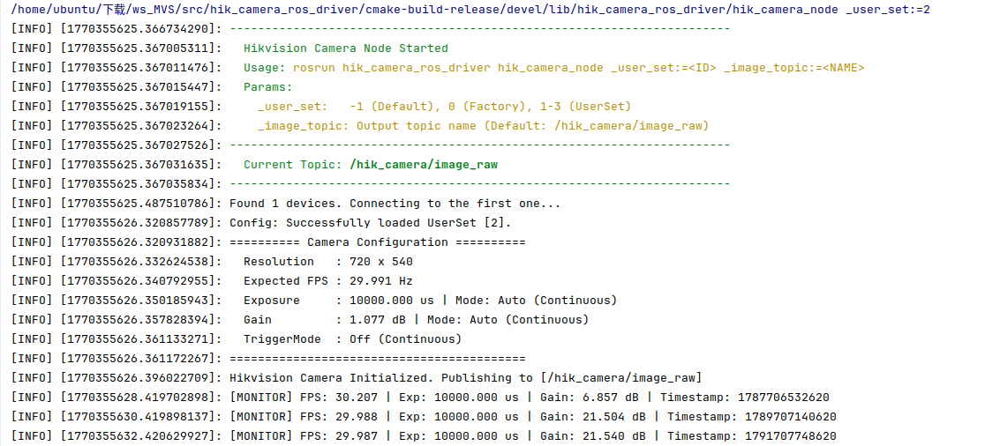

# Hikvision Camera ROS Driver 海康威视相机 ROS 驱动

这是一个轻量级海康威视（Hikvision）工业相机 ROS 驱动节点。

> ⚠️ **说明**：海康威视官方目前尚未推出官方 ROS 驱动，本项目为第三方开发的非官方驱动版本。

## 📖 设计理念

**极致轻量**，本驱动仅利用海康相机自带的 **User Set（用户集）** 功能，不会自行设置任何参**数防止覆盖**。

**工作流：**
* 在 Windows/Linux 的 MVS 客户端中通过 GUI 调试好最佳图像效果并保存设置到用户集。
* ROS 驱动启动时通过参数直接加载指定配置。

---



---

## ✨ 主要特性

* **自动架构检测**：CMake 脚本会自动识别 `x86_64` (PC) 或 `aarch64` (Jetson/树莓派) 架构，并链接对应的 MVS 库文件，无需手动修改路径。
* **用户集加载**：支持通过 ROS 参数加载 Default 或 UserSet1~3，实现参数的快速切换。
* **智能错误诊断**：自动解析错误码，针对 "资源被占用"、"IP网段不匹配"、"防火墙拦截" 等常见问题给出具体的解决建议。
* **实时状态监控**：每 2 秒在终端输出一次**真实 FPS**、**实时曝光时间**、**实时增益**以及**硬件时间戳**，方便监控相机运行状态（特别是自动曝光模式下）。
* **详细配置打印**：启动时自动打印分辨率、理论最大帧率、以及当前的曝光/增益控制模式（自动/手动）。

## 🛠️ 依赖环境

1.  **ROS**: Noetic (Ubuntu 20.04) 或 Melodic (Ubuntu 18.04)， Arm / x86 均适配。
2.  **Hikvision MVS SDK**: 请前往海康机器人官网下载并安装 [MVS 客户端](https://www.hikrobotics.com/)。
    * 默认安装路径应为 `/opt/MVS`。
3.  **OpenCV**: 用于图像格式转换。

## 🚀 编译安装

```bash
# 1. 进入工作空间 src 目录
cd ~/catkin_ws/src

# 2. 克隆或放入本项目 (文件夹名必须为 hik_camera_ros_driver)
git clone git@github.com:xiaofan4122/hik_camera_ros_driver.git

# 3. 编译
cd ~/catkin_ws
catkin_make

# 4. 刷新环境
source devel/setup.bash
```

## 运行

以默认设置运行

```bash
rosrun hik_camera_ros_driver hik_camera_node
```

指定topic运行（默认为`/hik_camera/image`）

```bash
rosrun hik_camera_ros_driver hik_camera_node _image_topic:=/camera_front/image
```

以某用户集设置运行

```bash
rosrun hik_camera_ros_driver hik_camera_node _user_set:=<ID>
```

其中 _user_set (int, default: -1):

- `-1`: 保持 MVS 设定的默认配置 (Default)。
- `0`: 加载出厂默认设置 (Factory Settings)。
- `1`: 加载用户集 1 (UserSet1)。
- `2`: 加载用户集 2 (UserSet2)。
- `3`: 加载用户集 3 (UserSet3)。


## 📊 终端输出示例

启动成功后，您将看到如下详细信息：

```Plaintext

[ INFO] ========== Camera Configuration ==========
[ INFO]   Resolution   : 2448 x 2048
[ INFO]   Expected FPS : 30.000 Hz (Max theoretical)
[ INFO]   Exposure     : 5000.000 us | Mode: Manual (Off)
[ INFO]   Gain         : 10.000 dB | Mode: Auto (Continuous)
[ INFO]   TriggerMode  : Off (Continuous)
[ INFO] ==========================================
[ INFO] Hikvision Camera Initialized. Publishing images...

```

运行过程中每隔 2 秒刷新监控数据：

```Plaintext
[ INFO] [MONITOR] FPS: 29.985 | Exp: 5000.120 us | Gain: 10.500 dB | Timestamp: 8945612301
```