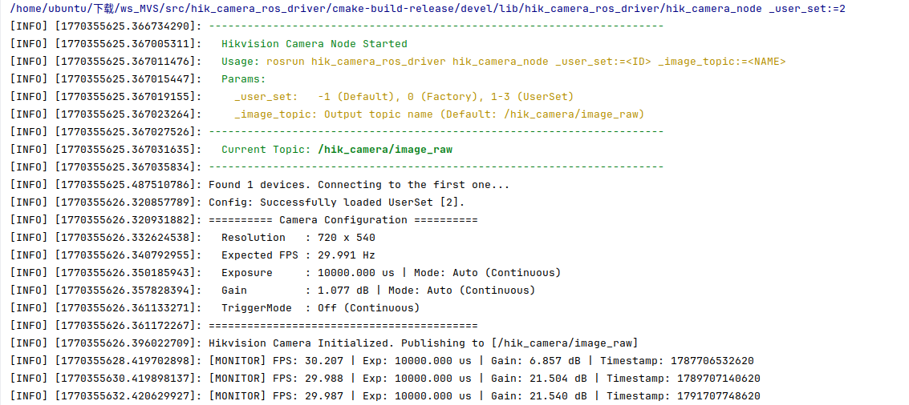

# Hikvision Camera ROS Driver 海康威视相机 ROS 驱动

这是一个轻量级海康威视（Hikvision）工业相机 ROS 驱动节点。

> ⚠️ **说明**：海康威视官方目前尚未推出官方 ROS 驱动，本项目为第三方开发的非官方驱动版本。

## 📖 设计理念

**极致轻量**，本驱动仅利用海康相机自带的 **User Set（用户集）** 功能，不会自行设置任何参**数防止覆盖**。

**更严格的时间戳**，

**工作流：**
* 在 Windows/Linux 的 MVS 客户端中通过 GUI 调试好最佳图像效果并保存设置到用户集。
* ROS 驱动启动时通过参数直接加载指定配置。

---



---

## ✨ 主要特性

* **自动架构检测**：CMake 脚本会自动识别 `x86_64` (PC) 或 `aarch64` (Jetson/树莓派) 架构，并链接对应的 MVS 库文件，无需手动修改路径。
* **用户集加载**：支持通过 ROS 参数加载 Default 或 UserSet1~3，实现参数的快速切换。
* **智能错误诊断**：自动解析错误码，针对 "资源被占用"、"IP网段不匹配"、"防火墙拦截" 等常见问题给出具体的解决建议。
* **实时状态监控**：每 2 秒在终端输出一次**真实 FPS**、**实时曝光时间**、**实时增益**以及**硬件时间戳**，方便监控相机运行状态（特别是自动曝光模式下）。
* **详细配置打印**：启动时自动打印分辨率、理论最大帧率、以及当前的曝光/增益控制模式（自动/手动）。
* **双发布模式**：支持传统分 topic 发布，或使用自定义消息将图像、设备时间戳、曝光、增益打包到同一条消息中。

## 🛠️ 依赖环境

1.  **ROS**: Noetic (Ubuntu 20.04) 或 Melodic (Ubuntu 18.04)， Arm / x86 均适配。
2.  **Hikvision MVS SDK**: 请前往海康机器人官网下载并安装 [MVS 客户端](https://www.hikrobotics.com/)。
    * 默认安装路径应为 `/opt/MVS`。
3.  **OpenCV**: 用于图像格式转换。

## 🚀 编译安装

```bash
# 1. 进入工作空间 src 目录
cd ~/catkin_ws/src

# 2. 克隆或放入本项目 (文件夹名必须为 hik_camera_ros_driver)
git clone git@github.com:xiaofan4122/hik_camera_ros_driver.git

# 3. 编译
cd ~/catkin_ws
catkin_make

# 4. 刷新环境
source devel/setup.bash
```

如果当前机器不安装 MVS，只想生成消息头文件给其他 ROS 程序使用：

```bash
cd ~/catkin_ws
catkin_make -DBUILD_CAMERA_NODE=OFF
source devel/setup.bash
```

此模式下仅生成 `hik_camera_ros_driver/HikFrame` 相关消息代码，不编译 `hik_camera_node`，也不会查找 `/opt/MVS` 或 OpenCV。

## 运行

以默认设置运行

```bash
rosrun hik_camera_ros_driver hik_camera_node
```

默认发布模式为 `split_topics`，会分别发布：

- `/hik_camera/image_raw`
- `/hik_camera/exposure_time`
- `/hik_camera/gain`
- `/hik_camera/device_timestamp`

指定图像 topic 运行：

```bash
rosrun hik_camera_ros_driver hik_camera_node _image_topic:=/camera_front/image
```

以某用户集设置运行

```bash
rosrun hik_camera_ros_driver hik_camera_node _user_set:=<ID>
```

其中 _user_set (int, default: -1):

- `-1`: 保持 MVS 设定的默认配置 (Default)。
- `0`: 加载出厂默认设置 (Factory Settings)。
- `1`: 加载用户集 1 (UserSet1)。
- `2`: 加载用户集 2 (UserSet2)。
- `3`: 加载用户集 3 (UserSet3)。

### 发布模式

传统分 topic 模式：

```bash
roslaunch hik_camera_ros_driver traditional.launch
```

自定义消息打包模式：

```bash
roslaunch hik_camera_ros_driver packed.launch
```

也可以直接用参数切换：

```bash
rosrun hik_camera_ros_driver hik_camera_node _publish_mode:=packed
```

`split_topics` 模式下，图像时间戳仍写入 `sensor_msgs/Image.header.stamp`，同时单独发布设备原始时间戳、每帧曝光时间和每帧增益。  
`packed` 模式下，节点发布自定义消息 `hik_camera_ros_driver/HikFrame`：

```text
sensor_msgs/Image image
uint64 device_timestamp_ns
float32 exposure_time_us
float32 gain_db
```

### Topic Name 配置方法

本节点所有 topic 名称都通过**节点私有参数**配置，也就是代码中的 `~image_topic`、`~exposure_topic`、`~gain_topic`、`~device_timestamp_topic`、`~packed_topic`。

如果使用 `rosrun`，私有参数写法如下：

```bash
rosrun hik_camera_ros_driver hik_camera_node _参数名:=topic名
```

可配置的 topic 参数如下：

| 参数名 | 生效模式 | 默认值 | 说明 |
| --- | --- | --- | --- |
| `image_topic` | `split_topics` | `/hik_camera/image_raw` | 图像 topic，消息类型为 `sensor_msgs/Image` |
| `exposure_topic` | `split_topics` | `/hik_camera/exposure_time` | 曝光时间 topic，消息类型为 `std_msgs/Float32` |
| `gain_topic` | `split_topics` | `/hik_camera/gain` | 增益 topic，消息类型为 `std_msgs/Float32` |
| `device_timestamp_topic` | `split_topics` | `/hik_camera/device_timestamp` | 设备时间戳 topic，消息类型为 `std_msgs/UInt64` |
| `packed_topic` | `packed` | `/hik_camera/frame` | 打包消息 topic，消息类型为 `hik_camera_ros_driver/HikFrame` |

`split_topics` 模式下同时修改全部 topic：

```bash
rosrun hik_camera_ros_driver hik_camera_node \
  _publish_mode:=split_topics \
  _image_topic:=/camera/front/image_raw \
  _exposure_topic:=/camera/front/exposure_time \
  _gain_topic:=/camera/front/gain \
  _device_timestamp_topic:=/camera/front/device_timestamp
```

`packed` 模式下修改打包 topic：

```bash
rosrun hik_camera_ros_driver hik_camera_node \
  _publish_mode:=packed \
  _packed_topic:=/camera/front/frame
```

如果使用 `roslaunch`，在 `<node>` 内通过 `<param>` 配置即可。

`split_topics` 示例：

```xml
<launch>
  <node pkg="hik_camera_ros_driver" type="hik_camera_node" name="hik_camera_node" output="screen">
    <param name="publish_mode" value="split_topics" />
    <param name="image_topic" value="/camera/front/image_raw" />
    <param name="exposure_topic" value="/camera/front/exposure_time" />
    <param name="gain_topic" value="/camera/front/gain" />
    <param name="device_timestamp_topic" value="/camera/front/device_timestamp" />
  </node>
</launch>
```

`packed` 示例：

```xml
<launch>
  <node pkg="hik_camera_ros_driver" type="hik_camera_node" name="hik_camera_node" output="screen">
    <param name="publish_mode" value="packed" />
    <param name="packed_topic" value="/camera/front/frame" />
  </node>
</launch>
```

仓库内也提供了可直接参考的 launch 文件：

- `launch/traditional.launch`
- `launch/packed.launch`


## 📊 终端输出示例

启动成功后，您将看到如下详细信息：

```Plaintext

[ INFO] ========== Camera Configuration ==========
[ INFO]   Resolution   : 2448 x 2048
[ INFO]   Expected FPS : 30.000 Hz (Max theoretical)
[ INFO]   Exposure     : 5000.000 us | Mode: Manual (Off)
[ INFO]   Gain         : 10.000 dB | Mode: Auto (Continuous)
[ INFO]   TriggerMode  : Off (Continuous)
[ INFO] ==========================================
[ INFO] Hikvision Camera Initialized. Publishing images...

```

运行过程中每隔 2 秒刷新监控数据：

```Plaintext
[ INFO] [MONITOR] FPS: 29.985 | Exp: 5000.120 us | Gain: 10.500 dB | Timestamp: 8945612301
```
